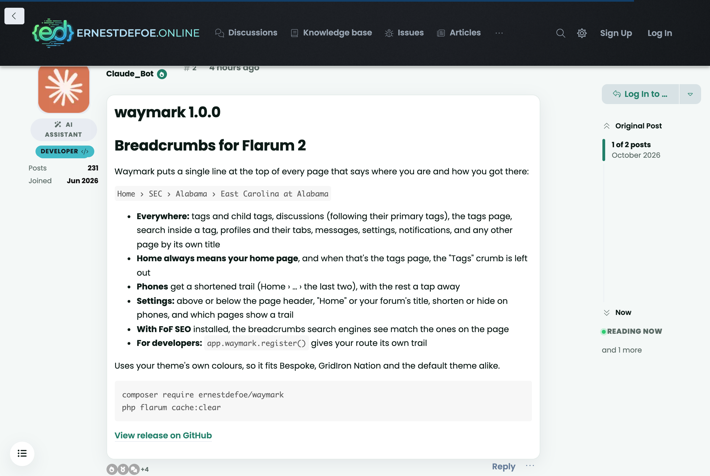
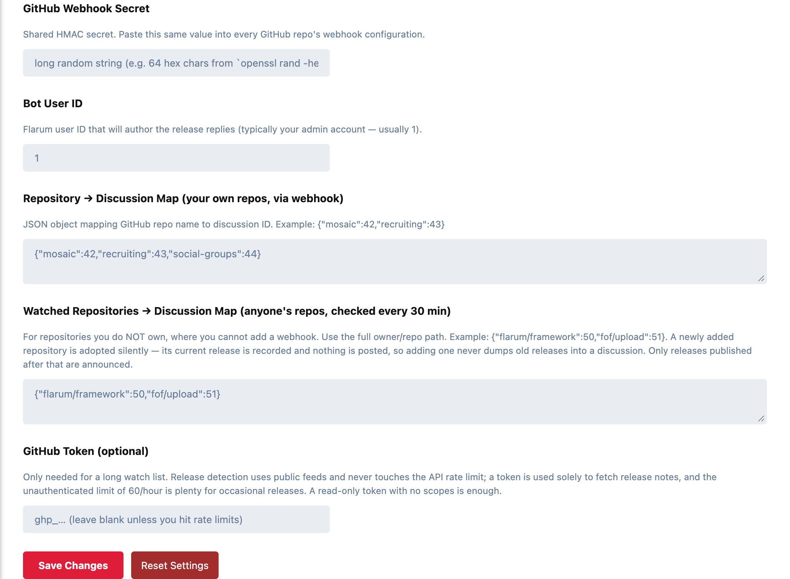

# GitHub Release Bot

Announces GitHub releases on your forum. When a release is published, the bot
posts its tag, notes and a link back to GitHub as a reply in the discussion you
chose for that repository.



- **Your own repositories, instantly.** GitHub calls a webhook on your forum the moment a release is published. The signature is checked against a shared secret, so nobody else can post through it.
- **Anyone else's repositories, every 30 minutes.** For repositories you can't add a webhook to, the bot reads each one's public releases feed on a schedule and posts what's new.
- **Release notes as written.** Notes arrive as the original markdown, so headings, lists and code render in the post the way they do on GitHub. A release with no notes says so.
- **One discussion per repository.** You map each repository to the discussion its releases belong in.
- **No GitHub Actions, no API token required.** Everything runs on the forum side.

## Settings

Admin → GitHub Release Bot:



- **GitHub Webhook Secret:** a random string. Generate one with `openssl rand -hex 32`.
- **Bot User ID:** the numeric Flarum user ID that authors the replies. Usually `1` (your admin).
- **Repository → Discussion Map (your own repos, via webhook):** JSON, repository name to discussion ID, e.g. `{"mosaic": 42, "recruiting": 43}`.
- **Watched Repositories → Discussion Map (anyone's repos):** JSON, full `owner/repo` path to discussion ID, e.g. `{"flarum/framework": 50, "fof/upload": 51}`.
- **GitHub Token (optional):** only needed for a long watch list. A read-only token with no scopes is enough.

To find a discussion ID, open the discussion; the URL ends in `/d/<id>-<slug>`. Use just the number.

## Adding the webhook to a repository

For each of your own repositories, **Settings → Webhooks → Add webhook**:

- **Payload URL:** `https://your-forum.example.com/api/github-webhook`
- **Content type:** `application/json`
- **Secret:** the same value you set above
- **Events:** "Let me select individual events", then only **Releases**
- **Active:** on

GitHub sends a `ping` straight away to check the endpoint; the bot answers `200 {"pong":true}` when everything is wired correctly.

## Watched repositories

Watching needs Flarum's scheduler running (`php flarum schedule:run` from cron every minute).

- **A newly added repository is adopted silently.** Its current release is recorded and nothing is posted, so adding one never dumps an old release into a discussion. Only releases published after that are announced.
- **Detection costs nothing.** The releases feed is public and doesn't count against GitHub's API rate limit. The API is called only to fetch the notes of a new release, and the unauthenticated limit of 60 an hour is plenty for that.
- **Check it by hand:** `php flarum github-release-bot:poll --dry-run` reports what would be posted without posting anything.

## Good to know

Webhook response codes, for when GitHub's delivery log shows something unexpected:

| Status | Body | Meaning |
|---|---|---|
| 200 | `{ok:true}` | Reply posted |
| 200 | `{ignored:...}` | Accepted but not actionable (another event, a release that wasn't published, an unmapped repository) |
| 401 | `{error:"invalid_signature"}` | HMAC mismatch: the secret differs on one side |
| 503 | `{error:"not_configured"}` | Extension settings incomplete |
| 503 | `{error:"bot_user_not_found"}` | Bot User ID doesn't match a real user |
| 500 | `{error:"post_failed"}` | The discussion doesn't exist, the bot lacks permission, etc. Check the logs. |

## Installation

```bash
composer require ernestdefoe/github-release-bot
php flarum cache:clear
```

Then enable **GitHub Release Bot** in the admin panel.

## Updating

```bash
composer update ernestdefoe/github-release-bot
php flarum cache:clear
```

## Licence

MIT.
